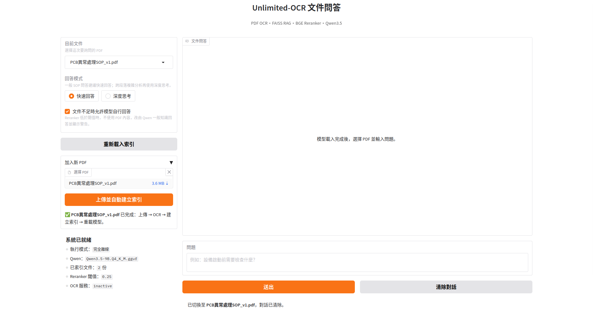
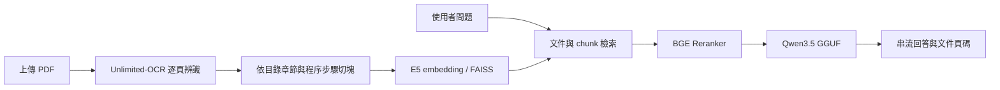

# Unlimited-OCR：Jetson 離線文件問答

在 NVIDIA Jetson 上執行的 PDF OCR 與 RAG 文件問答系統。整合 **Baidu Unlimited-OCR、E5 向量檢索、FAISS、BGE Reranker 與 Qwen3.5 GGUF**，提供中文 Gradio 操作介面，從 PDF 上傳、文字辨識、文件切塊、索引建立到串流問答，可在同一介面完成。

此儲存庫收錄本機專案的主要程式與實機截圖。模型權重、原始 PDF、OCR 快取、向量索引、測試報告及備份檔未納入版本控制。

## 實機執行畫面

下圖來自 **EAC-6000 / NVIDIA Jetson Orin NX 16GB** 的實際桌面截圖，擷取於 **2026-09-24 22:43**。畫面顯示 PDF 已完成「上傳 → OCR → 建立索引 → 重載模型」，以及離線模式、Qwen 模型與已索引文件數量。



圖片已裁除上方瀏覽器列與左側桌面工具列，保留應用程式畫面；來源、裁切範圍與 SHA-256 記錄於 [截圖說明](docs/screenshots/README.md)。

## 功能

- PDF 逐頁 OCR，使用檔案雜湊與每頁快取，支援中斷後續跑。
- GUI 上傳 PDF，自動完成 OCR、依目錄章節／查修步驟切塊、建立 E5 FAISS 索引並重新載入模型。
- 文件與 chunk 兩層檢索，搭配 BGE Reranker 篩選內容。
- Qwen3.5 提供快速回答、深度思考與串流輸出，回答附文件名稱與頁碼。
- 支援設定文件不足時的回答方式，並可手動重載索引。
- 上傳與索引流程暫時釋放模型，降低 Jetson 記憶體壓力。
- 提供 FastAPI 文件問答、PDF 上傳及 PCB SOP 分析介面。



## 主要程式

| 檔案 | 用途 |
| --- | --- |
| `app.py` | Gradio GUI、PDF 上傳與自動建索引流程 |
| `ocr_pipeline.py` | 預設 OCR 批次／監看管線與逐頁快取 |
| `ocr_pipeline_heading_aware.py` | 保留 Markdown 標題階層的 OCR 管線變體 |
| `toc_step_aware_chunker.py` | 依 PDF 目錄與程序步驟切塊，GUI 使用 `--no-embed` 模式 |
| `build_rag_index.py` | E5 embedding、增量快取與雙層 FAISS 索引 |
| `rag_search_reranker.py` | 向量檢索與 BGE 重排序 |
| `rag_chat_engine.py` | 文件上下文、來源與問答引擎 |
| `local_llm.py` | llama.cpp / Qwen3.5 的快速、思考與串流推論 |
| `semantic_rechunk_qwen.py` | 可選的 Qwen 語意再切塊工具 |
| `sop_api.py` | FastAPI 文件問答與 SOP 分析 |

## 環境與安裝

本機環境為 JetPack 6、Jetson Orin NX 16GB，使用 conda `LLM` 環境。檢查到的核心版本：PyTorch `2.8.0`、torchvision `0.23.0`、Transformers `4.57.1`、Gradio `5.49.1`、llama-cpp-python `0.3.34`。GPU 套件需依 JetPack／CUDA 與硬體安裝；`requirements.txt` 不會替換已安裝的 PyTorch。

```bash
git clone https://github.com/jim-coming/Unlimited-OCR.git
cd Unlimited-OCR

# 先準備與裝置 CUDA 相容的 PyTorch、torchvision
python -m pip install -r requirements.txt

# llama.cpp GPU 推論：需可用的 C/C++ 編譯器、CMake 與 CUDA toolkit
CMAKE_ARGS="-DGGML_CUDA=on" python -m pip install "llama-cpp-python==0.3.34"
```

### 模型準備

程式預設離線執行，**首次使用前需先準備模型**：

| 模型 | 用途／放置方式 |
| --- | --- |
| `baidu/Unlimited-OCR` | OCR，下載至 Hugging Face 快取 |
| `intfloat/multilingual-e5-base` | Embedding，下載至 Hugging Face 快取 |
| `BAAI/bge-reranker-v2-m3` | 重排序，下載至 Hugging Face 快取 |
| `Qwen3.5-9B.Q4_K_M.gguf` | 問答，放在 `models/` 或用 `--model` 指定路徑 |

可在連網準備階段預先下載 Hugging Face 模型，完成後再啟動應用：

```bash
python - <<'PY'
from huggingface_hub import snapshot_download
for repo_id in (
    "baidu/Unlimited-OCR",
    "intfloat/multilingual-e5-base",
    "BAAI/bge-reranker-v2-m3",
):
    snapshot_download(repo_id)
PY

mkdir -p models input
# 將取得的 Qwen3.5-9B.Q4_K_M.gguf 放入 models/
```

GUI 切塊使用 `--no-embed`，不需要額外的 Qwen 2B embedding 模型。若要執行切塊工具的可選 GGUF embedding 輸出，需另備 `Qwen3.5-2B-Q5_K_M.gguf` 或使用該工具的 `--model` 參數。

## 執行

### Gradio 文件問答

```bash
python app.py --model models/Qwen3.5-9B.Q4_K_M.gguf
```

開啟 <http://127.0.0.1:7860>，在「加入新 PDF」選擇文件，按「上傳並自動建立索引」。處理完成後選擇文件並輸入問題。

發布版預設以程式所在目錄為專案根目錄，索引位於 `flash/vector/`。如需沿用其他位置的索引，可設定 `YUNTECH_RAG_VECTOR_DIR`；模型可設定 `QWEN_GGUF_PATH` 或使用 `--model`。

### 手動執行管線

將 PDF 放入 `input/`，依序執行：

```bash
python ocr_pipeline.py
python toc_step_aware_chunker.py --no-embed
python build_rag_index.py \
    --chunks-file flash/rag/all_chunks_toc_step.jsonl \
    --output-dir flash/vector \
    --batch-size 4
python app.py --model models/Qwen3.5-9B.Q4_K_M.gguf
```

OCR 持續監看模式：

```bash
python ocr_pipeline.py --watch --scan-interval 15
```

### FastAPI

```bash
QWEN_GGUF_PATH="$PWD/models/Qwen3.5-9B.Q4_K_M.gguf" \
    python -m uvicorn sop_api:app --host 127.0.0.1 --port 8002
```

API 文件：<http://127.0.0.1:8002/docs>。

| 路徑 | 方法 | 用途 |
| --- | --- | --- |
| `/health` | GET | 健康檢查 |
| `/api/knowledge` | GET | 文件清單 |
| `/api/knowledge/upload` | POST | 上傳 PDF，回傳非同步工作 |
| `/api/chat` | POST | 文件問答 |
| `/api/chat/stream` | POST | 串流文件問答 |
| `/api/analyze` | POST | PCB 異常與 SOP 分析 |

可用 `SOP_API_KEY` 設定 API 金鑰，請求放入 `X-API-Key` 標頭。PCB SOP 文件名稱可透過 `PCB_SOP_FILE` 設定。

## 本機產生的資料

```text
Unlimited-OCR/
├── app.py 與主要 Python 模組
├── docs/screenshots/     # 已收錄的實機畫面
├── input/               # 使用者 PDF，執行時自行建立
├── models/              # GGUF 模型，執行時自行準備
└── flash/               # OCR、RAG 與索引輸出
    ├── cache/
    ├── rag/
    ├── vector/
    └── logs/
```

`.gitignore` 排除 `input/`、`models/`、`flash/` 與環境／憑證檔案，避免把本機文件與大型產物加入 Git。

## 來源與授權

本專案基於 [Baidu Unlimited-OCR](https://github.com/baidu/Unlimited-OCR) 模型與原始專案，加入 Jetson OCR 管線、RAG、GUI 與 API 整合。保留原專案 [MIT License](LICENSE) 與 Baidu 著作權聲明；第三方模型的使用條件請依各模型發布頁面。
